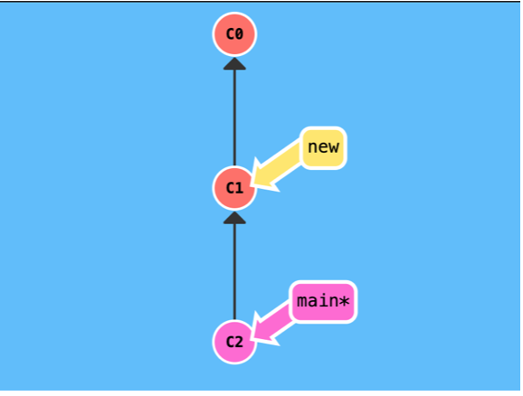
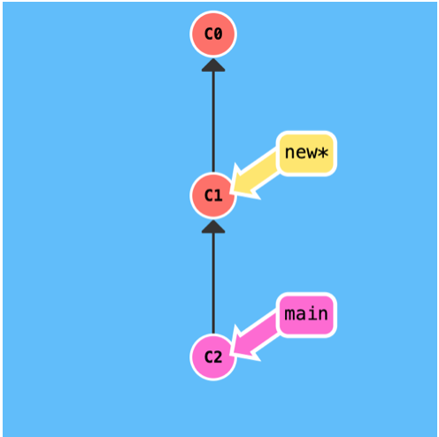
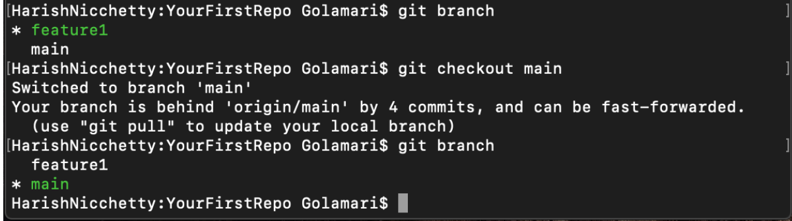

## Git checkout

The git checkout command lets you point to the current branch among the branches created using the git branch. Git will record all new commits on that branch. Git checkout gives us the freedom to point the HEAD to a branch quickly.
#### For example there are two branches main and new.
step1: HEAD is pointing to main branch

Step 2: After entering “git checkout new” command the HEAD points to new.

#### For coding you need to use command git checkout branch-name to point HEAD at that branch.

