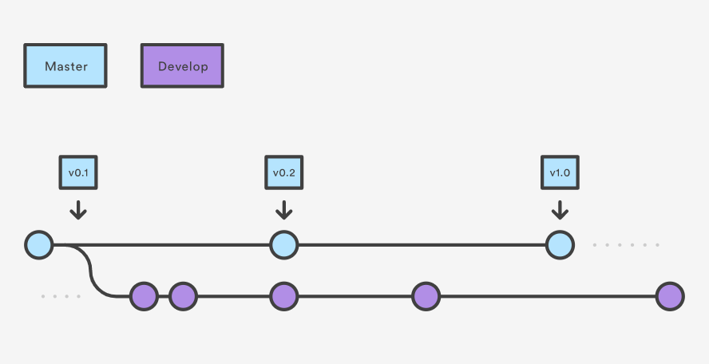
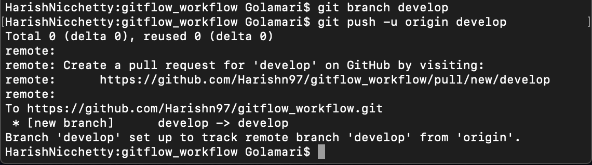
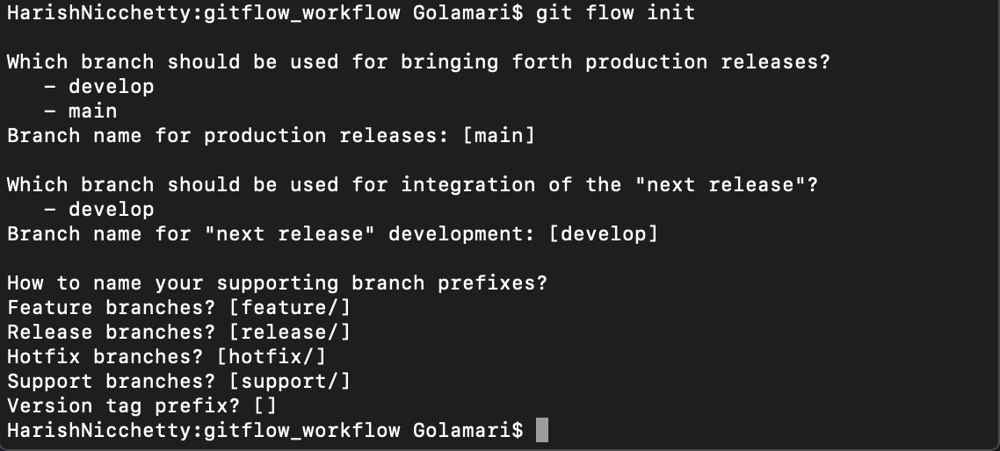
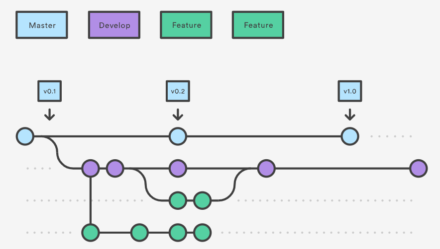
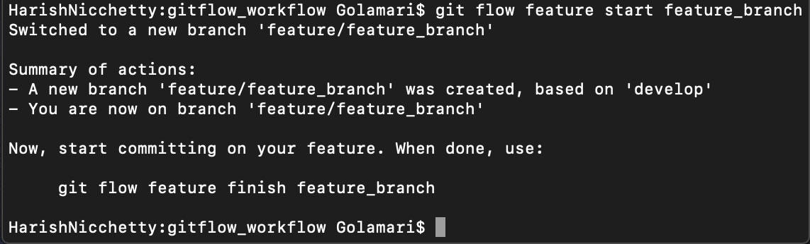
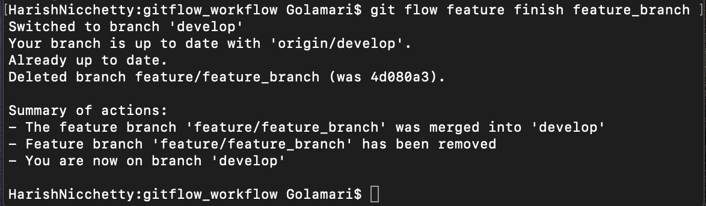
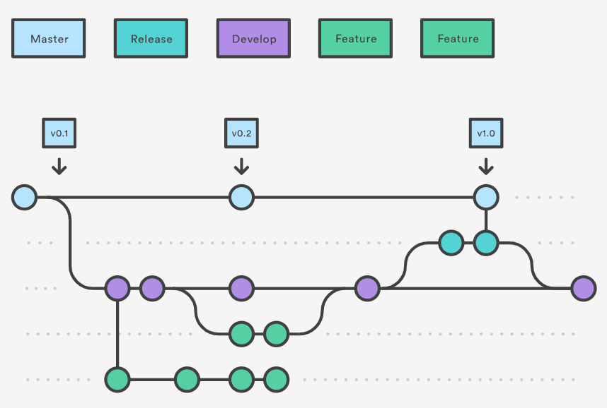
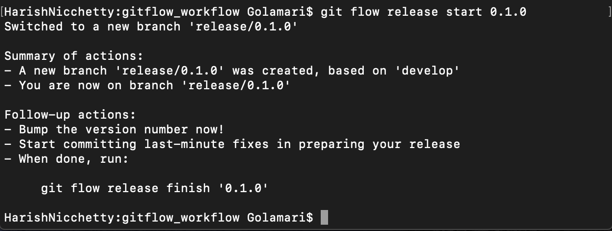
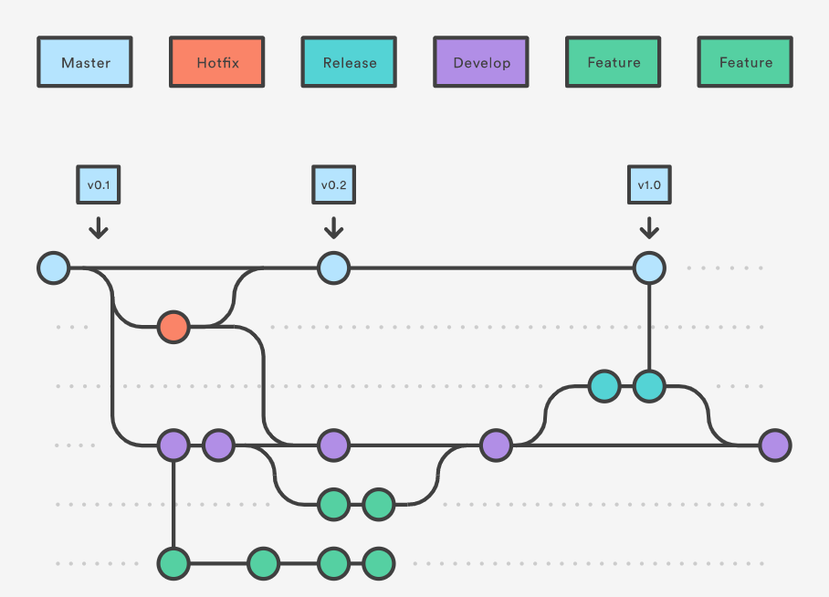
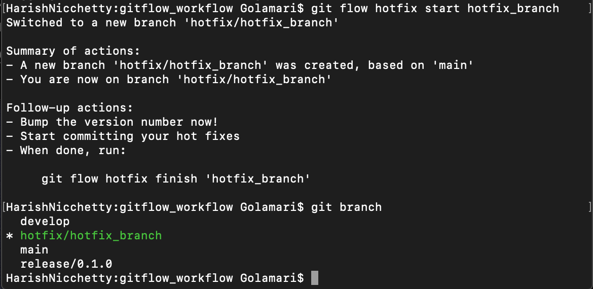

## Gitflow Workflow

#### Gitflow Workflow is a Git workflow that helps with continuous software development and defines a strict branching model designed around the project release. So it provides a robust framework for managing larger projects comfortably. 
#### Gitflow is ideally suited for projects that have a scheduled release cycle, such as continuous delivery. It assigns particular roles to different branches and defines how and when they should interact. In addition to feature branches, it uses individual branches for preparing, maintaining, and recording releases. The Feature Branch Workflow: pull requests, isolated experiments, and more efficient collaboration are all implemented.

## How it works

#### Instead of a single master branch, this workflow uses two branches to record the history of the project. The master branch stores the official release history, and the develop branch serves as an integration branch for features. It's also convenient to tag all commits in the master branch with a version number.

- Create a branch in local and push the branch into remote repository.

- When using the git-flow extension library, executing git flow init on an existing repo will create the develop branch:

- Each new feature should reside in its own branch, which can be pushed to the central repository for backup/collaboration. But, instead of branching off of master, feature branches use develop as their parent branch. When a feature is complete, it gets merged back into develop. Features should never interact directly with master.

- Creating a feature branch
'git flow feature start feature_branch'

- After the development work on the feature, the next step is to merge the feature_branch into develop.

- Once develop has acquired enough features for a release, you fork a release branch off of develop. Creating this branch starts the next release cycle, so no new features can be added after this point—only bug fixes, documentation generation, and other release-oriented tasks should go in this branch. 
Once it's ready, the release branch gets merged into master and tagged with a version number. In addition, it should be merged back into develop, which may have progressed since the release was initiated.

- We can create a git release branch using the following command.
'git flow release start 0.1.0
Switched to a new branch 'release/0.1.0''

- Once the release is ready to ship, it will get merged it into master and develop, then the release branch will be deleted. It’s important to merge back into develop because critical updates may have been added to the release branch and they need to be accessible to new features.

- Some key takeaways to know about Gitflow are:

1. The workflow is great for a release-based software workflow.
2. Gitflow offers a dedicated channel for hotfixes to production.

