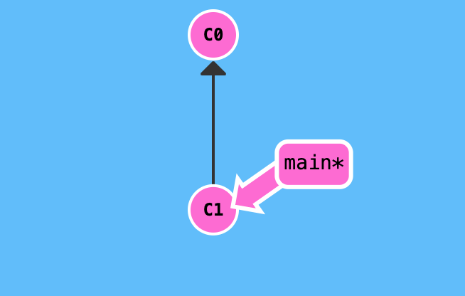
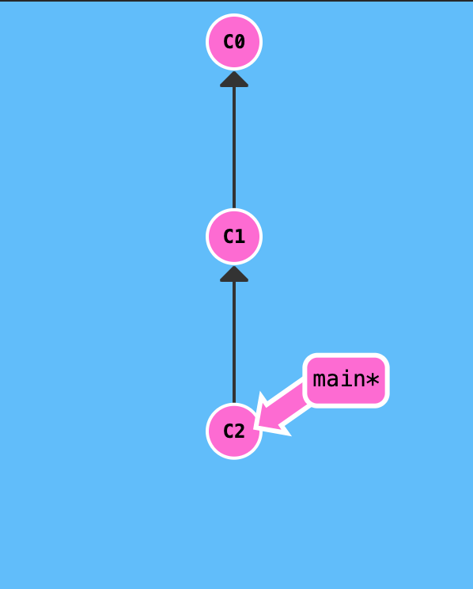

## Master Branch

#### A branch in Git is simply a pointer that points to one of the commits. The default branch name in Git is master. As we start making commits, we are given a master branch that points to the most recent commit we made. Every time we commit, the master branch pointer moves forward with the latest commit. The “master” branch in Git is not a special branch. It is precisely like any other branch. The git init command creates it by default.

#### In Git, "master" is a naming convention for a branch. After cloning (downloading) a project from a remote server, the resulting local repository has a single local branch: the so-called "master" branch. This means that "master" can be seen as a repository's "default" branch.

For example :
1) After the creating a repository there will be a default branch called main pointing to the most recent commit.

2) After committing once the master branch will move to point the most recent commit c2.

