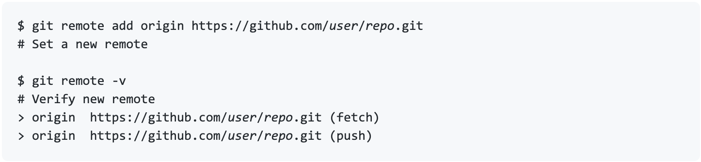

## Git Remote

#### The git remote command lets you create, view, and delete connections to other repositories. Remote connections are more like bookmarks rather than direct links into other repositories. Instead of providing real-time access to another repository, they serve as convenient names that can be used to reference a not-so-convenient URL.

---

## Remote Add
#### The git remote command is one of many Git commands that takes additional appended 'subcommands'. Below is an examination of the commonly used git remote subcommands.
**ADD <NAME> <URL>**
Adds a record to ./.git/config for remote named at the repository url.
#### To add a new remote, use the git remote add command on the terminal, in the directory your repository is stored at.
#### The git remote add command takes two arguments:
- A remote name, for example, origin
- A remote URL, for example, https://github.com/user/repo.git
#### for example: 

---

