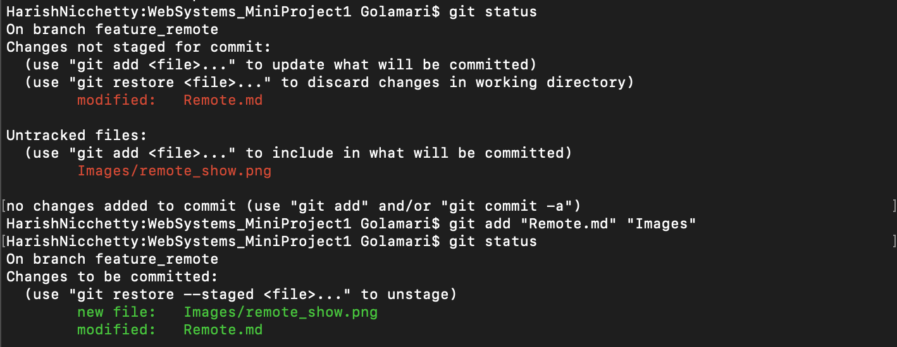

## Git Status

#### Git status shows the current state of your Git working directory and staging area. It lets you see which changes have been staged, which haven’t, and which files aren’t being tracked by Git. When you want to check, run git status. It is always a good idea. The git status command only outputs information, it won't modify commits or changes in your local repository.

#### Generally we use 'git status' for:
- Where HEAD is pointing, whether that is a branch or a commit.
- If you have any changed files in your current directory that have not yet been committed then it will show those files in red font colour. If the missing files are added then the font colour will change to green.
- If changed files are staged or not.
- If your current local branch is linked to a remote branch, then git status will tell you if your local branch is behind or ahead by any commits and helps to avoid conflicts while merging.

