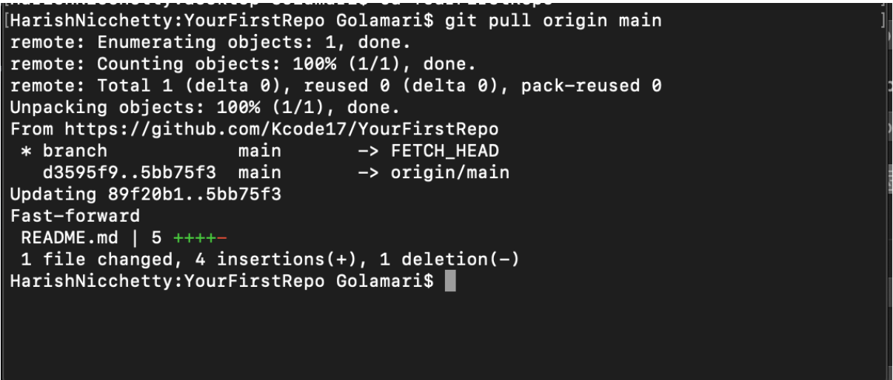
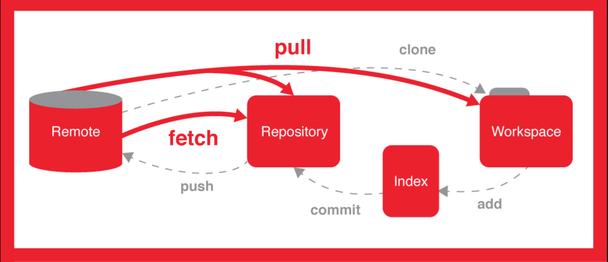

## Git Pull

#### The git pull command can retrieve and copy content from a remote repository and update the local repository to match that content. Merging remote changes into your local repository can be used in Git collaborations. The git pull command is a combination of two other commands, git fetch followed by git merge. Firstly git pull will execute a git fetch scoped to the local branch that HEAD is pointed at. After downloading the information, git pull will merge branches. A new commit will be-created, and HEAD will point to the new commit.

- Git pull is considered unsafe when compared to `fetch` command because `pull` command will try to alter information in local to identical to remote. This may sometimes cause problems.

-The git pull command is actually a combination of two other commands, `git fetch` followed by `git merge`

---

