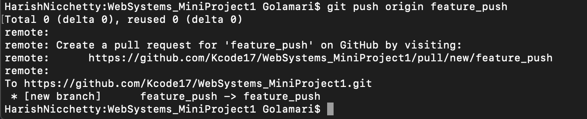

## git push
#### The git push command is used to upload local repository content to a remote repository. Using the push command, we can transfer commits from our local repository to a remote repository. It's the counterpart to git fetch, but fetching imports commits to local branches, pushing exports to remote branches. Remote branches are configured using the git remote command. 

- Pushing will overwrite changes, so caution should be taken when pushing. 

---

#### Git will push the related commits and internal objects to a local branch in destination repository. 

#### This is similar to above command but it will allow commits which result in non-fast-forward-merge.

#### Push all of your local branches to the specified remote.

#### Tags will not be automatically pushed when you push a branch. The --tags flag sends all of your local tags to the remote repository.

